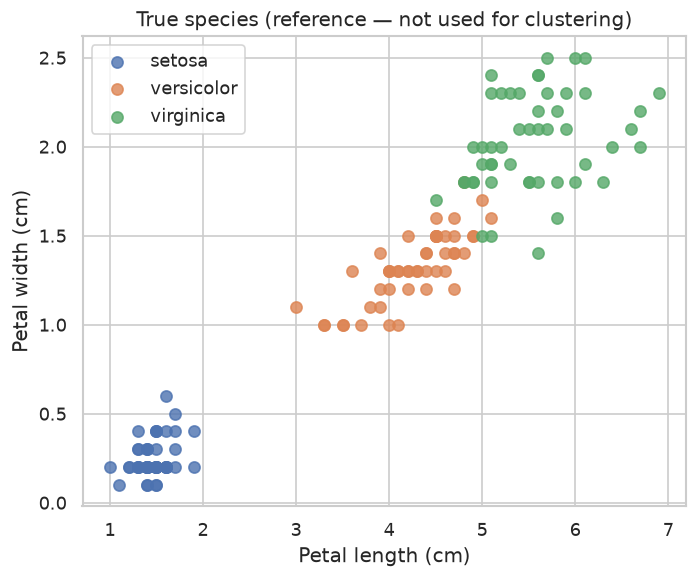
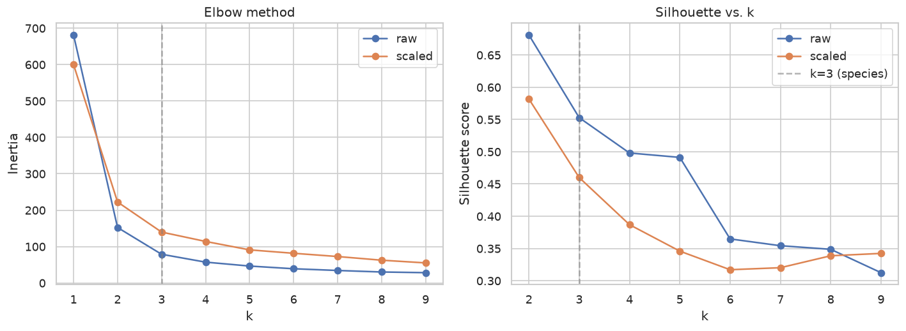
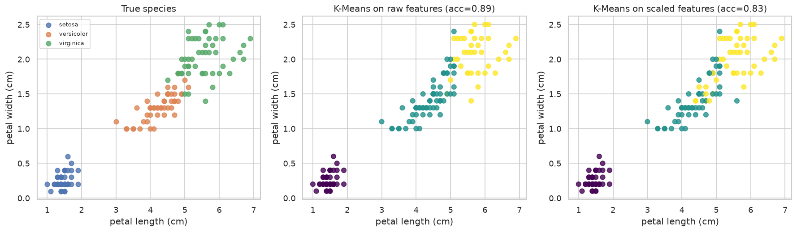
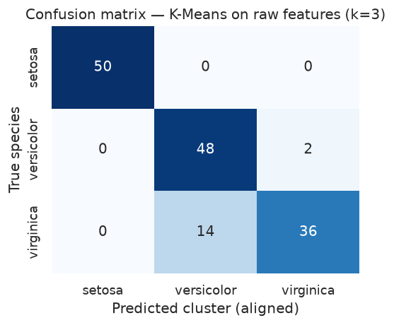

# 🌸 Iris K-Means Clustering (Unsupervised Learning)

Unsupervised K-Means clustering on the classic Iris dataset. The focus is not "accuracy" (K-Means never sees labels) but **choosing k without labels**, and a counter-intuitive, empirically-verified finding: **standardizing the features makes clustering worse** on this particular dataset.

## Results at a glance

| Metric | Raw features (final model) | Standardized features |
|--------|:--:|:--:|
| k | 3 | 3 |
| Silhouette score | **0.553** | 0.460 |
| Davies–Bouldin index (lower is better) | **0.662** | — |
| Accuracy vs. true species (post-hoc, Hungarian-aligned) | **89.3%** | 83.3% |
| Best k by silhouette alone (no domain knowledge) | 2 | 2 |
| Samples | 150 | 150 |
| Model artifact | `outputs/model.joblib` | — |

Metrics from the latest run are saved in [`docs/assets/run_summary.json`](docs/assets/run_summary.json).

## Visual results









## Key takeaways

- **Raw (unscaled) features beat standardized features** on every metric — accuracy 89.3% vs. 83.3%, silhouette 0.553 vs. 0.460. This contradicts the usual "always scale for distance-based algorithms" advice.
- **Why**: all 4 features already share the same unit (cm). Petal length/width are the truly species-discriminative features (|r| ≈ 0.95 with species) and *should* dominate the distance calculation; `StandardScaler` equalizes every feature's influence, diluting that signal and inflating the weakest, anti-correlated feature (`sepal width`, r ≈ -0.43).
- **Initialization matters as much as scaling.** A naive single-run comparison (`n_init=1`) made the raw-vs-scaled gap look enormous (89% vs. 58%) purely because the scaled run got unlucky and converged to a poor local optimum. Using `n_init=10` for every configuration revealed the real, smaller, but still consistent gap — never compare K-Means configurations from a single run.
- **Internal metrics alone would have picked k=2, not k=3.** Both the elbow curve and the silhouette score decrease monotonically past k=2, because versicolor/virginica overlap heavily and no internal metric rewards splitting an already-blurry blob in two. This is a structural limitation of unsupervised model selection — always cross-check internal metrics against domain knowledge and visualization.
- **Where K-Means fails**: nearly all residual error is versicolor ↔ virginica confusion (14 of 50 virginica misassigned); setosa is recovered with 100% accuracy since it's linearly separable from the other two species.

## Quick start

```bash
pip install -r requirements.txt
jupyter notebook kmeans_clustering_iris.ipynb
```

Run all cells top to bottom. The notebook:
1. Loads the Iris dataset via `sklearn.datasets.load_iris` (species label kept only for post-hoc validation).
2. Compares raw vs. standardized features across k=2..9 with the Elbow Method, Silhouette Score, and Davies–Bouldin index.
3. Fits K-Means (k=3), aligns cluster IDs to species with the Hungarian algorithm, and analyzes *why* raw features win.
4. Scores unseen samples (`data/iris_sample.csv`) and saves `outputs/model.joblib` + `docs/assets/run_summary.json`.

## Project structure

```
iris-kmeans-clustering/
├── kmeans_clustering_iris.ipynb   # main notebook (EDA → k selection → clustering → analysis → artifacts)
├── data/
│   └── iris_sample.csv            # a few unlabeled samples for the inference demo
├── docs/
│   └── assets/                    # README charts + run_summary.json (committed)
├── outputs/                       # model.joblib (gitignored)
└── requirements.txt
```

## Dataset

The classic [Iris flower dataset](https://scikit-learn.org/stable/datasets/toy_dataset.html#iris-plants-dataset) (Fisher, 1936) — 150 samples, 4 numeric features (sepal/petal length & width, cm), 3 species (setosa, versicolor, virginica), loaded via `sklearn.datasets.load_iris`.
